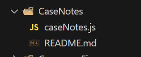

# New Module Coding Standards

When creating new modules we need to start adapting better coding practices so our software is easier to maintain over the years as we add new features and enhance existing ones.

## Folder & File Structure

1. Folders should be named after the module using PascalCase.
2. Each module folder will have an "entry point" file that uses same name as folder except spelled using camelCase rather than PascalCase.

## Coding Standards

1. Always use functions
2. Only use `let` or `const` for variables
3. IIFE functions should always use `const` and variable name should be ?
